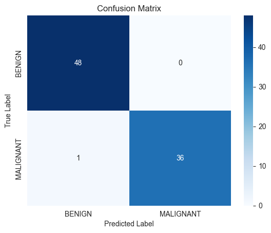
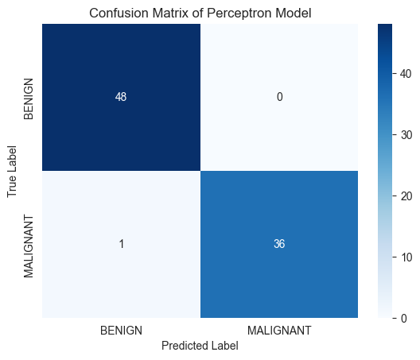

# Breast Cancer Classifier

index: [About the Dataset](#about-the-dataset) | [Models Used](#models-used)

models: 
- [Logistic Regression](#logistic-regression)
- [Perceptron](#perceptron)
- [k-Nearest Neighbors](#k-nearest-neighbors)

## About the Dataset

This dataset contains 569 instances of tumors, with 30 numeric features from digitized images of a fine needle aspirate (FNA) of a breast mass. The dataset is credited to Dr. William H. Wolberg, physician at the University Of Wisconsin Hospital at Madison, Wisconsin, USA. The dataset was used by Dr. Wolberg to test a machine learning algorithm to diagnose breast cancer.

# Models Used

## Logistic Regression

**Notebook:** [Logistic Regression](notebooks/logistic_regression.ipynb)

**Accuracy:** 0.99

### Confusion Matrix

## Perceptron

**Notebook:** [Perceptron](notebooks/perceptron_classifier.ipynb)

**Accuracy:** 0.99

### Confusion Matrix

## k-Nearest Neighbors

**Notebook:** [k-Nearest Neighbors](notebooks/k_nearest_neighbors.ipynb)

**Accuracy:** 0.96

### Confusion Matrix

